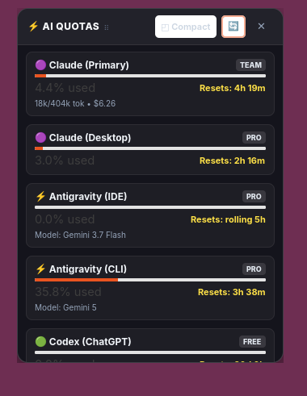
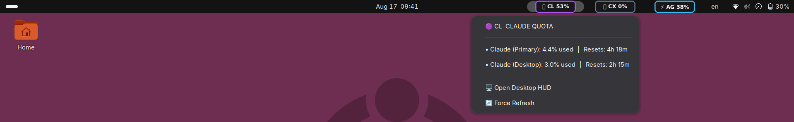

# QuotaPulse ⚡
> ### **Never get hit by a surprise AI rate limit again.**

Ever been deep in coding flow, only to get slammed with:  
`❌ "You have reached your usage limit. Try again in 4 hours."`  
Your flow is broken, your task is stalled, and you had no idea you were close to the cap.

---

### **Why you need QuotaPulse (in 10 seconds):**
- ⚡ **Glance at your live limits**: See remaining quota across **Claude**, **Antigravity**, **ChatGPT (Codex)**, and **Cursor** directly on your taskbar and desktop.
- ⏱️ **Exact reset countdowns**: Know the exact hour and minute your 5-hour rolling pool or monthly quota refreshes.
- 🔔 **Warning before lockout**: Get notified at **80% and 90%** so you can switch models or wrap up *before* hitting a hard brick wall.
- 🔒 **Zero friction**: 0 API keys, 0 logins. Double-click and it auto-detects all your existing logged-in tools locally.

---

## 📸 Screenshots

<div align="center">

### 🖥️ 1. Floating Desktop HUD
*Draggable, resizable, always-on-top overlay with live progress bars and reset countdowns.*



---

### 📊 2. Top Bar Taskbar Live Chips
*Directly visible on your taskbar so you never need to click open a menu to check your status.*



</div>

---

## 💻 Supported Operating Systems

| Operating System | Compatibility | Features Supported |
|---|---|---|
| 🐧 **Linux** | Ubuntu 22.04 / 24.04+, Debian, Fedora, Arch | Native GTK4 Floating HUD, Wayland & X11 Draggable Window, Top Bar Taskbar Chips |
| 🪟 **Windows** | Windows 10 & Windows 11 | 1-Click Desktop Setup, Frameless Dark Glass HUD, Taskbar Tray & Toast Alerts |
| 🍎 **macOS** | macOS 12 Monterey or newer | Cross-Platform Floating Overlay |

---

## 🤖 Supported AI Apps & Accounts

QuotaPulse automatically detects your active logins and tracks exact pool limits:

- **🟣 Claude**:
  - **Claude Code CLI**: Tracks rolling 5-hour token limits, total session cost ($), burn rate ($/hr), and model family distribution (Sonnet / Haiku / Opus).
  - **Claude Desktop App**: Tracks live 5-hour and 7-day quota usage directly from your desktop app.
- **⚡ Google Antigravity**:
  - **Antigravity CLI**: Dynamically tracks active 5-hour Gemini pools, conversation step volume, and real-time reset countdowns.
  - **Antigravity IDE**: Live session activity and quota monitoring.
- **🟢 OpenAI Codex / ChatGPT**:
  - Automatically queries official production rate limits, plan tiers (`FREE` / `PLUS` / `PRO`), and rolling reset epochs.
- **🖱️ Cursor IDE**:
  - Tracks monthly Fast Request usage (`used / 500`), slow requests, and billing cycle renewal dates.

---

## ✨ Features You'll Love

- **👀 Always-Visible Taskbar Chips**: See your live percentage badges right in your top bar without clicking anything.
- **⏱️ Exact Reset Countdowns**: Know precisely how many hours and minutes remain until your 5-hour rolling pool or weekly limit resets.
- **🔔 Proactive Quota Alerts**:
  - Gentle **Warning Notification** when any model approaches **80%**.
  - Urgent **Critical Alert** at **90%** so you can switch models before getting locked out.
  - Built-in anti-spam debounce.
- **◰ Compact & Full Views**: Switch between a compact glanceable list and detailed model cards with a single click.
- **🔒 100% Private & Local**: Zero third-party servers. QuotaPulse runs entirely locally on your machine and reads from your existing local app configs.

---

## 🚀 Getting Started

### 🐧 On Linux (Ubuntu / GNOME / Wayland / X11)

1. **Clone the repository**:
   ```bash
   git clone https://github.com/MichaelGavanAI/QuotaPulse.git
   cd QuotaPulse
   pip install --user -r requirements.txt
   ```

2. **Launch**:
   - **Floating Desktop Widget**:
     ```bash
     python3 hud/desktop_hud.py
     ```
   - **Top Bar Taskbar Chips**:
     ```bash
     python3 hud/topbar_indicator.py
     ```

*(Autostart is automatically configured to launch on desktop login).*

---

### 🪟 On Windows (10 & 11)

1. Download or clone this repository to your computer.
2. Double-click **`setup_windows.bat`**.
3. **That's it!** QuotaPulse will:
   - Install required dependencies automatically.
   - Place a convenient **`AI Quotas`** icon on your Windows Desktop.
   - Start the widget and configure it to launch on Windows startup.

---

## ⚙️ Customization

Customize alert thresholds in `~/.config/ai-quota-overlay/config.json` (or `%APPDATA%\ai-quota-overlay\config.json` on Windows):

```json
{
  "ui": {
    "warning_threshold_pct": 80.0,
    "critical_threshold_pct": 90.0,
    "notifications_enabled": true
  },
  "polling": {
    "daemon_interval_seconds": 60,
    "hud_refresh_seconds": 5
  }
}
```

---

## 📄 License

Distributed under the MIT License. Free for personal and commercial use.
