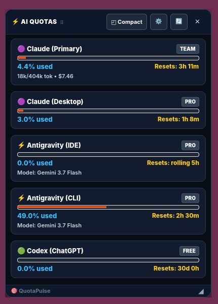
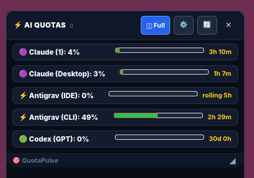
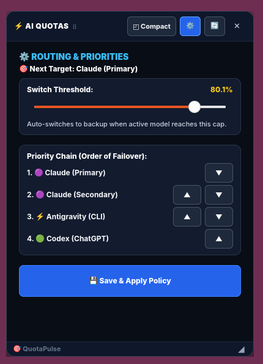

# QuotaPulse ⚡
> ### **Never get hit by a surprise AI rate limit again.**

Ever been deep in coding flow, only to get slammed with:  
`❌ "You have reached your usage limit. Try again in 4 hours."`  
Your flow is broken, your task is stalled, and you had no idea you were close to the cap.

---

### **Why you need QuotaPulse (in 10 seconds):**
- ⚡ **Glance at your live limits**: See remaining quota across **Claude**, **Antigravity**, **ChatGPT (Codex)**, and **Cursor** directly on your taskbar and desktop.
- ⏱️ **Exact reset countdowns**: Know the exact hour and minute your 5-hour rolling pool or monthly quota refreshes.
- 🔄 **Auto-Switch before lockout**: Set custom thresholds (e.g. 80%) so you automatically switch to backup accounts before getting blocked.
- 📋 **Zero-Loss Task Handoff**: Preserves in-flight goals, sub-steps, and git diffs across account swaps so the new model resumes immediately.
- 🔒 **Zero friction**: 0 API keys, 0 logins. Double-click and it auto-detects all your existing logged-in tools locally.

---

## 📸 Visual Showcase

<div align="center">

| 🖥️ **Full Cards HUD** | ◰ **Compact View** | ⚙️ **Settings & Router** |
|:---:|:---:|:---:|
|  |  |  |
| *Live progress bars & timers* | *Glanceable mini-rows* | *Interactive priority & limit editor* |

<br />

### 📊 **Top Bar Taskbar Live Chips**
*Directly embedded into your system top panel — see your status without clicking or opening menus.*


</div>

---

## 🔄 Intelligent Quota Relay Router & Task Handoff

QuotaPulse includes a smart dispatcher CLI (`ai`) that automatically selects the healthiest AI model before you hit a rate limit:

```bash
ai "Your task or prompt"
```

### How the Relay Works:
1. **Time-Aware Scoring**: Evaluates real-time 5-hour rolling pool usage and reset countdowns across your accounts:
   $$\text{Score} = (100 - \text{used\_pct}) \times \left(1 + \frac{\text{elapsed\_in\_window}}{5\text{h}}\right)$$
2. **Automatic Failover**: When your active model reaches the threshold (configured via HUD slider or `config.json`), tasks automatically route to the next available backup (`Claude 1` → `Claude 2` → `Antigravity` → `Codex`).
3. **Loss-less Task Handoff**: Checkpoints active goals, current sub-steps, architectural invariants, and uncommitted git files to `.git/.ai-quota-handoff.json` so the new model resumes immediately without exploration token waste.

### Routing Commands:
```bash
# Check current candidate rankings and selected target model
ai-quota-overlay route

# Save an in-flight task handoff checkpoint
ai-quota-overlay handoff save --goal "Fix auth bug" --step "Step 2/3" --next "Run vitest"

# View active handoff state
ai-quota-overlay handoff show
```

---

## 💻 Supported Operating Systems

| Operating System | Compatibility | Features Supported |
|---|---|---|
| 🐧 **Linux** | Ubuntu 22.04 / 24.04+, Debian, Fedora, Arch | Native GTK4 HUD, Wayland/X11 Interactive Resize Grip (`◢`), Top Bar Taskbar Chips |
| 🪟 **Windows** | Windows 10 & Windows 11 | 1-Click Desktop Setup (`setup_windows.bat`), Frameless Dark Glass HUD, Taskbar Tray & Toast Alerts |
| 🍎 **macOS** | macOS 12 Monterey or newer | Cross-Platform Floating Overlay |

---

## 🤖 Supported AI Apps & Accounts

QuotaPulse automatically detects your active logins and tracks exact pool limits:

- **🟣 Claude**:
  - **Claude Code CLI**: Tracks rolling 5-hour token limits, total session cost ($), burn rate ($/hr), and model family distribution (Sonnet / Haiku / Opus).
  - **Claude Desktop App**: Tracks live 5-hour and 7-day quota usage directly from your desktop app data.
- **⚡ Google Antigravity**:
  - **Antigravity CLI**: Dynamically tracks active 5-hour Gemini pools, conversation step volume, and real-time reset countdowns.
  - **Antigravity IDE**: Live session activity and quota monitoring.
- **🟢 OpenAI Codex / ChatGPT**:
  - Automatically queries official production rate limits, plan tiers (`FREE` / `PLUS` / `PRO`), and rolling reset epochs.
- **🖱️ Cursor IDE**:
  - Tracks monthly Fast Request usage (`used / 500`), slow requests, and billing cycle renewal dates.

---

## ✨ Features You'll Love

- **👀 Always-Visible Taskbar Chips**: See your live percentage badges right in your top bar without clicking anything.
- **⏱️ Exact Reset Countdowns**: Know precisely how many hours and minutes remain until your 5-hour rolling pool or monthly quota refreshes.
- **⚙️ Interactive Settings Panel**: Click `⚙️` in the HUD to drag the switch threshold slider or reorder model failover priorities with `▲` and `▼` buttons.
- **📐 Interactive Resizing & Size Memory**: Click and drag the corner grip (`◢`) to resize the HUD to any dimension on Wayland/X11. QuotaPulse automatically remembers your custom window sizes.
- **🔔 Proactive Quota Alerts**:
  - Gentle **Warning Notification** when any model approaches **80%**.
  - Urgent **Critical Alert** at **90%** so you can switch models before getting locked out.
- **◰ 1-Click Compact & Full Views**: Seamlessly toggle between compact mini-rows and detailed model cards.
- **🔒 100% Private & Local**: Zero third-party telemetry. QuotaPulse runs entirely locally on your machine.

---

## 🚀 Getting Started

### 🐧 On Linux (Ubuntu / GNOME / Wayland / X11)

1. **Clone the repository**:
   ```bash
   git clone https://github.com/korm85/QuotaPulse.git
   cd QuotaPulse
   pip install --user -r requirements.txt
   ```

2. **Launch**:
   - **Floating Desktop Widget**:
     ```bash
     python3 hud/desktop_hud.py
     ```
   - **Top Bar Taskbar Chips**:
     ```bash
     python3 hud/topbar_indicator.py
     ```

---

### 🪟 On Windows (10 & 11)

1. Download or clone this repository to your computer.
2. Double-click **`setup_windows.bat`**.
3. **That's it!** QuotaPulse will:
   - Install required dependencies automatically.
   - Place a convenient **`AI Quotas`** icon on your Windows Desktop.
   - Start the widget and configure it to launch on Windows startup.

---

## ⚙️ Configuration

Settings can be edited directly from the HUD `⚙️` UI or via `~/.config/ai-quota-overlay/config.json`:

```json
{
  "routing_policy": {
    "strategy": "claude_first_relay",
    "switch_threshold_pct": 80.0,
    "recovery_threshold_pct": 20.0,
    "fallback_chain": [
      "claude_primary",
      "claude_secondary",
      "antigravity_cli",
      "codex_primary"
    ]
  },
  "ui": {
    "window_width": 340,
    "window_height": 460,
    "warning_threshold_pct": 80.0,
    "critical_threshold_pct": 90.0,
    "notifications_enabled": true
  }
}
```

---

## 📄 License

Distributed under the MIT License. Free for personal and commercial use.
